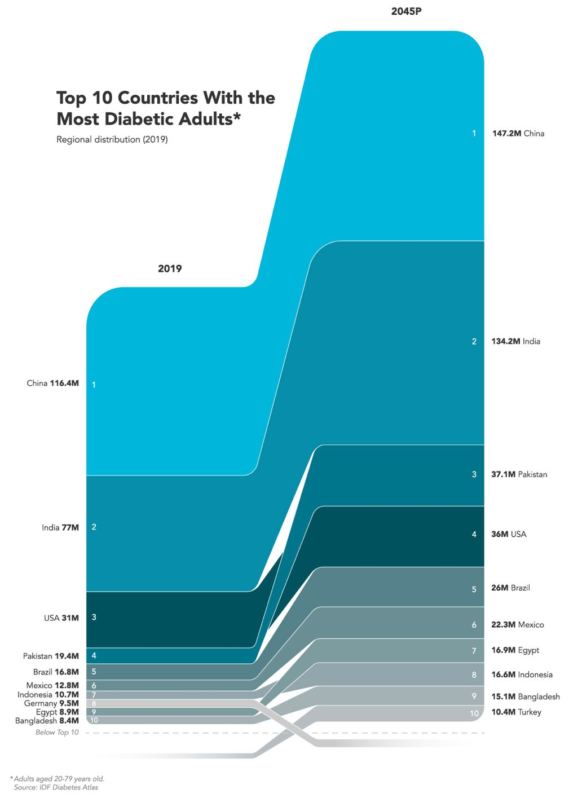

| [home page](https://cmustudent.github.io/tswd-portfolio-templates/) | [visualizing debt](visualizing-government-debt) | [critique by design](critique-by-design) | [final project I](final-project-part-one) | [final project II](final-project-part-two) | [final project III](final-project-part-three) |

# Critique by Design
## Step one: find a data visualization

Source: [Visual Capitalist](https://www.visualcapitalist.com/sp/the-high-cost-of-chronic-diseases-worldwide/)

## Step two: critique the data visualization

## Step three: sketch out a solution

## Step four: Test the solution

## Step five: Build your solution

    

    

