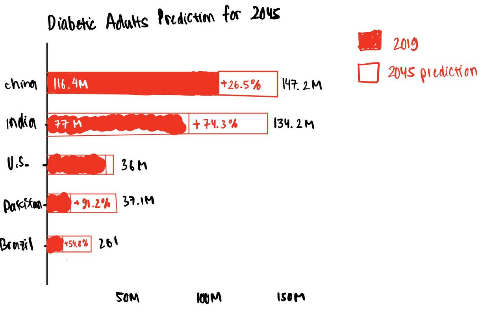
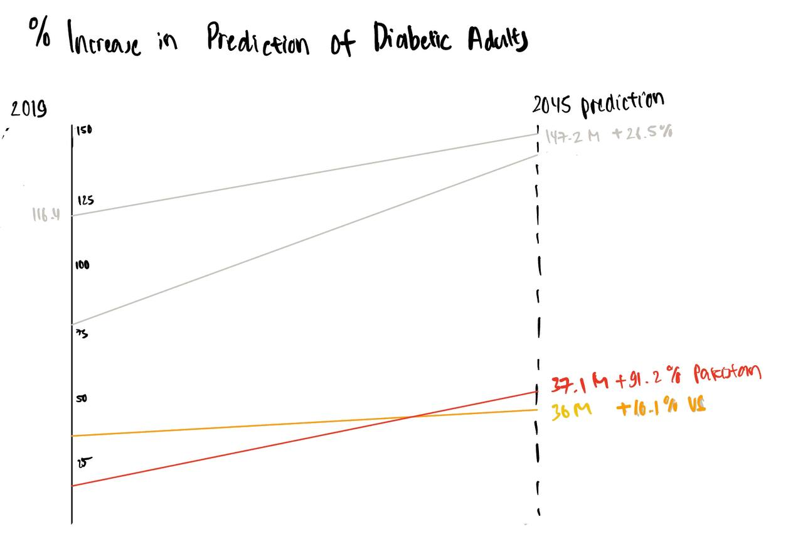
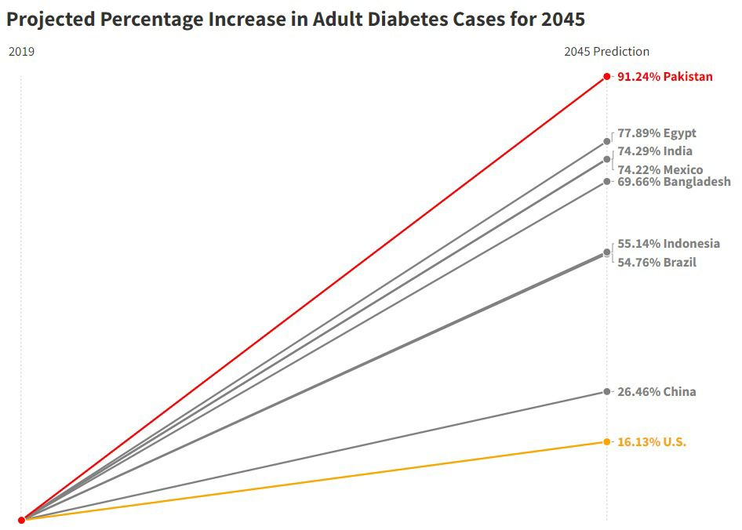

| [home page](https://merlinwijaya.github.io/tswd-portfolio/) | [visualizing debt](dataviz2.md) | [critique by design](critique-by-design.md) | [final project I](final-project-part-one) | [final project II](final-project-part-two) | [final project III](final-project-part-three) |

# Critique by Design
## Step one: find a data visualization

Source: [Visual Capitalist](https://www.visualcapitalist.com/sp/the-high-cost-of-chronic-diseases-worldwide/)

I was searching "chronic illness" in Google when I encountered this visual. This visual shows the top 10 countries with the most diabetic adults in 2019 and based on predictions for 2045. They used data from the IDF Diabetes Atlas. I chose this visual since I'm interested in global health-related data. Also, this is an interesting visual since I haven't encountered something constructed like this before. At first glance, it looks similar to the Sankey diagram. After looking for a few more seconds, I feel there's not much insight I got from this other than most countries are predicted to have an increased number of diabetic adults. Since the visual labels showed the total numbers, I wasn't sure how much the predicted number increased compared to the 2019 data. I had to do the math in my head to know that. Furthermore, the top 2 countries are also the top 2 most populous countries, so it wasn't surprising. I felt intrigued to visualize the percentage change rather than the total numbers. I was curious how the rank would change.

## Step two: critique the data visualization
Using Stephen Few's Data Visualization Effectiveness Profile, here are my critiques:

a. Informative

    1. Usefulness        :6/10

    2. Completeness      :8/10 
    
    3. Perceptibility    :7/10
    
    4. Truthfulness      :9/10
    
    5. Intuitiveness     :9/10

b. Emotive
    
    1. Aesthetics        :6/10
    
    2. Engagement        :7/10

### Overall observations about the data visualization
Things that didn't work well:
- The first thing that stood out to me was the big chunk of blue blocks. I needed to zoom out until 33% percent on my laptop screen to be able to see the whole visual. My thought is that they want to show comparison in an impactful way, hence the big blue blocks. However, this caused distraction and a lot of eye travel. This also caused the visual size proportions to be unsuitable for laptop screens where most people would access the visual.
- Another thing that I didn’t think worked quite well is the overlapping thinner lines that connect between 2019 and 2045p. These combined with the similar color choices for ranks 5-10, making it harder to trace how the rank moved between those years.
- Labelling both years as the total numbers of diabetic adults in each year didn't bring usefulness well. The audience at a glance can only see that most countries are predicted to have an increased number of diabetic adults. 

Things that worked well:
- I found that the country name and ranking labels worked well. It provides clarity and helps to intuit the visual well.
- I liked how it distinguished the below top 10 countries with dotted lines. This is easy to intuit and perceive.

Things I would do differently are:
- I would change how the values on 2045P are displayed. Rather than showing the total predicted number of diabetic patients, I would show the number increase or percent change from 2019 to 2045. This would increase the usefulness and perceptibility because the audience doesn’t have to calculate in their head the changes. 
- I would reduce the size of the blue blocks to have more whitespace and reduce distraction. I would use a slope chart if I were to visualize the total numbers since it gives a cleaner look, and this would increase truthfulness. It’s hard to compare the size between countries with the way it is. For example, in 2045, the size of the China and India blocks looks the same to me.
- I would label the data with percentage increase between those years, rather than displaying total numbers for both years.
- I would change the color used. Blue is not suitable for this since it doesn’t bring the effect of an alert. I would use red. This would increase the audience’s engagement. 
- I would add the word “predictions” to 2045P. This will add points to the completeness.

### Primary audience
Healthcare Professionals, including doctors, nurses, dietitians, and other healthcare providers who need statistics and information about diabetes prevalence for research, treatment planning, and public health initiatives are the primary audience. This visual does reach the audience since they are interested in health-related data predictions. However, it will be more useful and easier to compare the changes between countries by showing a percentage change. Percentage change provides a clear understanding of the size of a change. Other than that, the amount of eye travel needed to digest the visual also reduces the audience engagement because they might be reluctant to spend more than a few seconds looking at the visual.

### Final thoughts on this evaluation method 
This method is successful since it covers both contextual awareness and design execution by breaking down both into several smaller categories. I find this is more useful and easier to use than the good charts matrix. However, it is easier to interpret the good charts matrix quickly. One measure I find missing is the measure to assess whether or whether people with disabilities can use visualization. This takes into account considerations for colorblindness and others. I would add this inclusivity measurement with a scale of 0 as noninclusive to a scale of 10 as inclusive.

## Step three: sketch out a solution
My initial thoughts were to maintain the labels but add one more label, which is the percentage change between 2019 and 2045 predictions. Hence the first and second sketch. However, I quickly realized that it would make the visual busy. It would also confuse the audience since the visuals are still visualized based on the total numbers but I just added another label that wasn't being represented by the visual. Then I started the third sketch where I visualized the data only based on the percentage change on a slope chart. 

## Step four: Test the solution
I shared the sketches with two people and here are the feedbacks that I got:

1. Student, mid 20's
She said it was interesting to see how the rank and her perceptions changed a lot after seeing the third sketch where I used percentage change values. She mentioned how the slope chart isn't the right chart to visualize this data. She recommended using a bar plot and also added values for years 2019 and 2045 predictions on the pop-up. 

2. Doctor, late 20's
She expressed how she liked the original chart, especially the design construction part. She was surprised when she saw my sketches showing the percentage change. She said it was a very intriguing way to see and interpret the data. She also mentioned how she would prefer that I rebuild my third sketch using a different kind of chart type since it doesn't make sense and seems redundant cause all the data start from zero percent.

## Step five: Build your solution

    

I wanted to bring more awareness about the potential surge of adult diabetics. I also want other countries not to only compare their expected total numbers of adult diabetics with other countries, but also to show their rate of predicted increase. That's why I chose to still use the same datasets, but display the percentage change to see this data from another point of view. I decided on a bar chart based on the feedback I got from step four. Bar charts are suitable to compare numerical values between several categories. I also added data about the number of adult diabetics on the pop-up as feedback. With this, we can see how the rank totally changes. I highlighted Pakistan in red color as the country with the highest increase in percentage. I used orange to highlight the U.S. since even though it is the country with the lowest percentage on the bar chart, the U.S. is still predicted to have a significant increase in adult diabetics.
