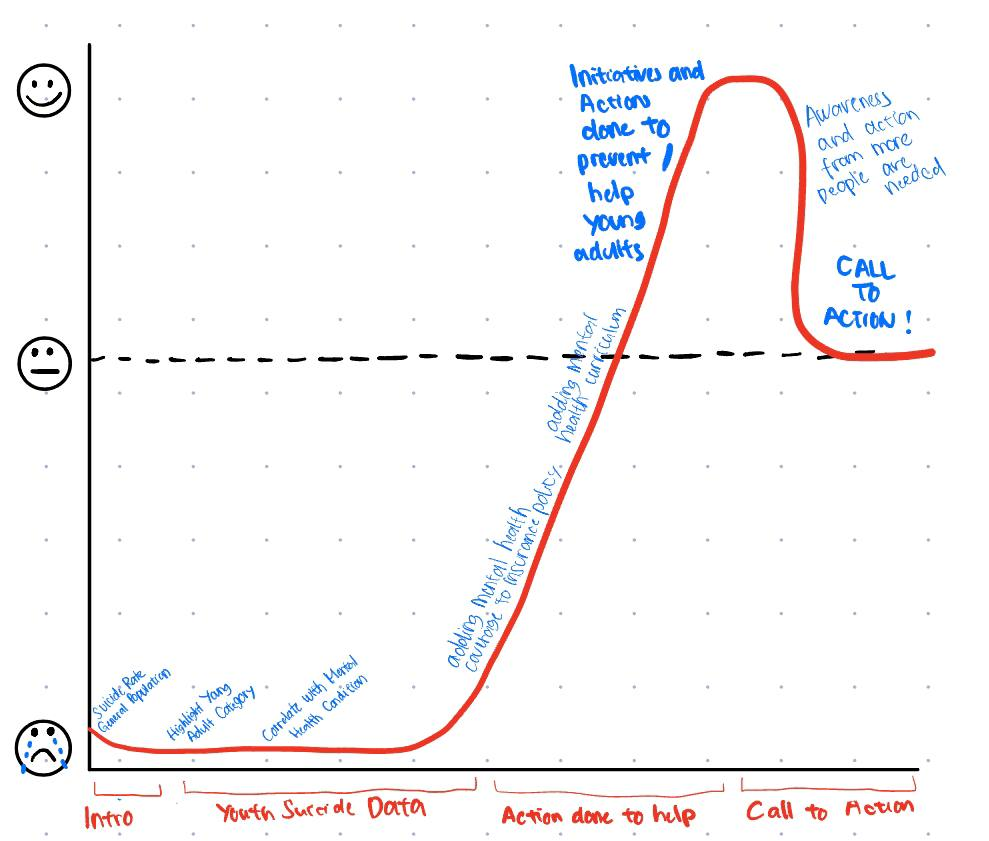

| [home page](https://cmustudent.github.io/tswd-portfolio-templates/) | [visualizing debt](visualizing-government-debt) | [critique by design](critique-by-design) | [final project I](final-project-part-one) | [final project II](final-project-part-two) | [final project III](final-project-part-three) |

# Outline
> High-level summary of your project 

I’m interested in public health, including population mental health. I want to address the issue of suicide, especially in the young adults category. My story arc would include introducing the topic by showing suicide incidents for the general population and then highlighting the young adults category. Following that would be the underlying cause of those attempts/incidents which is the mental health condition. After that, I would bring up initiatives people did for this problem, including in the education, insurance, or policy sectors and their impact of them. I would end the story with calls to action for the audience as an individual and also to policymakers. My goal with this project is to address the issue of young adults suicide by increasing awareness and leading people to help. 

> In-class exercise for the story arc:
One-line summary: Bringing Awareness and Empowering Communities to Prevent Young Adults Suicide

As a reader, I want to know the underlying causes of suicide attempts so that I can understand the urgent need for proactive intervention and support.

Call to action:

I can do this by:
-	Spreading awareness about youth suicide and reducing stigma through education and conversations
-	Supporting organizations conducting research to develop effective prevention strategies
-	Being an active listener and reaching out to those in need, encouraging them to seek professional help

Policymakers can do this by:
-	Adding mental health conditions coverage in health insurance policies
-	Reduce access to lethal means among persons at risk of suicide
-	Adding mental health education in education programs

## Initial sketches
> Post images of your anticipated data visualizations (sketches are fine). They should mimic aspects of your outline, and include elements of your story.  

Text here...

# The data
I uploaded a copy of the data to my [Google Drive](https://drive.google.com/drive/folders/1ZAqmYNhNKBN4cyEwy7CeuCTjJOoLUxdO?usp=drive_link).

| Name | URL | Description |
|------|-----|-------------|
|number-of-deaths-from-suicide-ghe.csv | [Our World in Data](https://ourworldindata.org/suicide?insight=suicide-rates-rise-with-age#key-insights-on-suicide) | Data from WHO Global Health Estimates showing the number of suicide for each countries in the dataset from 2000-2019 |
|suicide-rates-by-age-detailed-who.csv|[Our World in Data](https://ourworldindata.org/suicide?insight=suicide-rates-rise-with-age#key-insights-on-suicide)|Data from WHO Global Health Estimates showing the number of suicide indicators grouped by age groups |
|2022 State of Mental Health in America| [Mental Health America](https://mhanational.org/research-reports/2022-state-mental-health-america-report)|Annual State of Mental Health in America Report, which ranks all 50 states and the District of Columbia based on fifteen mental health prevalence and access measures for youth and adults|
|SPP_April2022.xlsx|[Institute of Education Sciences](https://ies.ed.gov/schoolsurvey/spp/)|Surver results for Mental Health and Well-Being of Students and Staff During the Pandemic|

I got my data mostly from international or national organizations that published public reports. I will use the first and second datasets in the table above for the introduction showing trends for the general population and focusing then on the young adults category. I would use the third dataset to show how mental health conditions correlate with suicide. Then I would show initiatives for suicide prevention from the education sector, by showing how schools provided mental health services from dataset 4.

# Method and medium
To complete this project, I plan to do:
1. Data Collection and Analysis: gather datasets from publicly available sources and do analysis.
2. Visual Building: visualize the data with Flourish.
3. Critique: ask for critiques for the visuals.
4. Medium Selection: use Shorthand as a medium where I would build my story arc. I would include visuals that I make alongside and description of the story.
